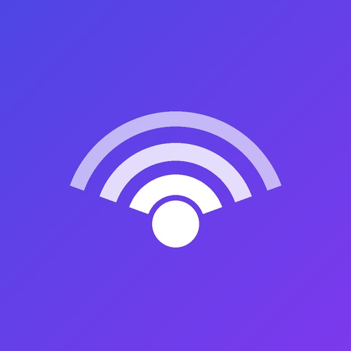

<div align="center">



# Beam

[](https://github.com/samarthsubramanya/KShare/actions/workflows/build.yml)


</div>

Beam is an AirDrop-style drop zone for Android, iOS, and desktop. Discover nearby devices on the same Wi-Fi network, pair once, and instantly send text, links, and files between them — no accounts, no cloud, no internet required.

Beam is a **single Kotlin Multiplatform codebase** — discovery, pairing, transport, persistence, and the entire UI are written once in `shared/` and compiled natively to Android, iOS, and desktop, with only the thinnest platform-specific glue (mDNS APIs, key-value storage) written per target.

Built with Kotlin Multiplatform + Compose Multiplatform for RevenueCat's Shipaton 2026 (Next Gen student track).

## Why Beam

Sharing a file or a link between your own phone and laptop usually means emailing it to yourself, messaging yourself on Slack, or fumbling with a cable. Beam skips all of that: devices on the same LAN find each other automatically, and once paired, sharing is a single tap.

The flagship flow: open a link on your phone, hit **Share → Beam**, pick your laptop, and the page opens there **immediately** — no copy-paste, no waiting.

## Features

- **Automatic discovery** — devices announce themselves over mDNS/Bonjour and appear on every other device on the network within seconds.
- **One-time pairing** — trust is established with a 6-digit PIN or by scanning a QR code (Android), then remembered for future sessions.
- **Instant sharing** — send plain text, URLs (which auto-open in the browser on the receiving device), or files.
- **OS share-sheet integration** — on Android, "Share" from any app straight into Beam.
- **Stays reachable** — an Android foreground service and a macOS menu-bar tray keep the app discoverable and paired even when it's not the active window.
- **Local-first** — everything happens over your LAN via a small embedded HTTP server; nothing is uploaded anywhere.

## How it works

| Concern | Approach |
|---|---|
| Discovery | mDNS/Bonjour — `NsdManager` (Android), `NSNetService`/`NSNetServiceBrowser` (iOS), `jmdns` (Desktop) |
| Transport | An embedded Ktor server (`/pair`, `/text`, `/file`) + a multiplatform Ktor HTTP client |
| Trust | A single-use, time-limited PIN (or QR code encoding the same handshake), verified before any device is marked paired |
| Persistence | SQLDelight, storing paired devices and transfer history locally on each device |
| Identity | A device ID generated once and persisted via platform key-value storage (`SharedPreferences` / `NSUserDefaults` / `Preferences`), so a device doesn't look like a new peer every relaunch |

Discovery, pairing, and the transport server all live in a single process-wide `BeamCore` object, deliberately decoupled from any screen's lifecycle — so an Android foreground service or the desktop Tray can keep everything running in the background.

## Project structure

```
shared/          Kotlin Multiplatform module — all shared logic and UI (Compose Multiplatform)
  commonMain/    Core app: discovery, pairing, transport, persistence, screens
  androidMain/   Android actuals: NsdManager, foreground service hooks, SharedPreferences
  iosMain/       iOS actuals: NSNetService, NSUserDefaults
  jvmMain/       Desktop actuals: jmdns, java.util.prefs, AWT/Swing interop
androidApp/      Android application shell
desktopApp/      Desktop (JVM) application shell, packaging, and app icons
iosApp/          iOS application shell (Xcode project)
```

## Tech stack

- Kotlin Multiplatform & Compose Multiplatform (Android, iOS, Desktop/JVM)
- [Ktor](https://ktor.io/) — embedded server + HTTP client
- [SQLDelight](https://cashapp.github.io/sqldelight/) — typed local persistence
- [qrcode-kotlin](https://github.com/g0dkar/qrcode-kotlin) + [zxing](https://github.com/journeyapps/zxing-android-embedded) — QR generation and scanning
- Koin — dependency injection
- Jetpack/AndroidX Navigation Compose

## Getting started

Requires JDK 17+ and Android Studio (or IntelliJ IDEA with the Kotlin Multiplatform plugin).

**Desktop:**
```bash
./gradlew :desktopApp:run
```

**Android:** open the project in Android Studio and run the `androidApp` configuration, or:
```bash
./gradlew :androidApp:installDebug
```

**iOS:** open `iosApp/iosApp.xcodeproj` in Xcode and run on a simulator or device.

All three run on the same LAN will discover and pair with each other automatically.

## Known limitations

- iOS QR scanning and displaying the device's own LAN IP aren't implemented yet (`getifaddrs` isn't exposed in the current Kotlin/Native platform-libs set) — PIN pairing works everywhere.
- Discovery requires all devices to be on the same local network; there's no relay/internet fallback by design.
