<div align="center">


# Beam

**AirDrop-style sharing for Android, iOS, and desktop — one Kotlin Multiplatform codebase.**

[](https://github.com/samarthsubramanya/KShare/actions/workflows/build.yml)


[Screenshots](#screenshots) · [Features](#features) · [How it works](#how-it-works) · [Getting started](#getting-started)

</div>

Discover nearby devices on the same Wi-Fi network, pair once, and instantly send text, links, and files between them — no accounts, no cloud, no internet required.

Beam is a **single Kotlin Multiplatform codebase**: discovery, pairing, transport, persistence, and the entire UI are written once in `shared/` and compiled to Android, iOS, and desktop, with only thin platform glue (mDNS APIs, key-value storage) written per target. Built with Kotlin Multiplatform + Compose Multiplatform for RevenueCat's Shipaton 2026 (Next Gen student track).

## Screenshots

### Mobile (Android)

<table>
  <tr>
    <td align="center">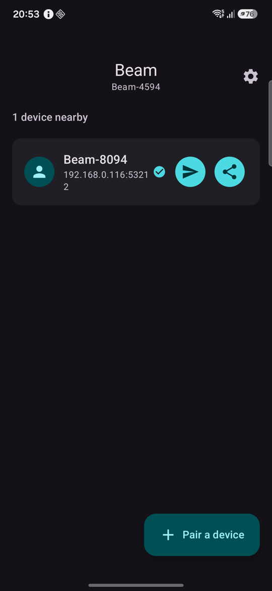<br/><sub><b>Nearby devices</b><br/>Send text/links or files with one tap</sub></td>
    <td align="center">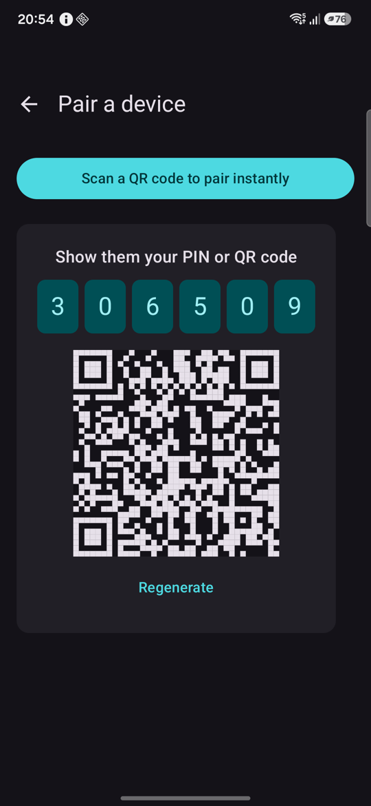<br/><sub><b>Pair a device</b><br/>6-digit PIN or QR code</sub></td>
    <td align="center">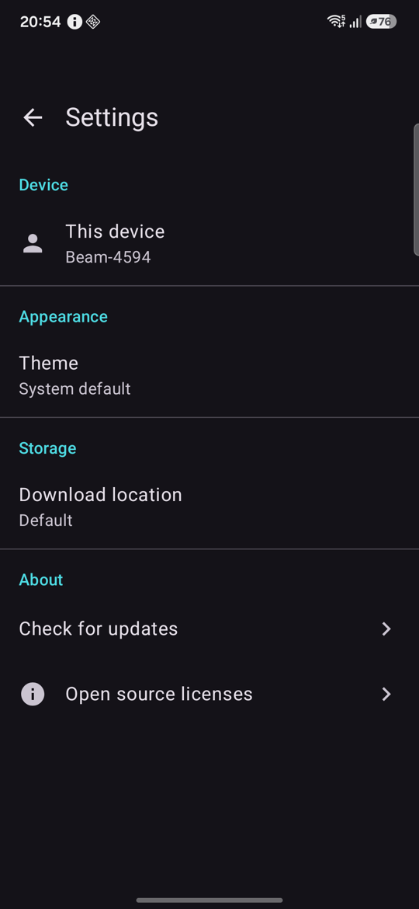<br/><sub><b>Settings</b><br/>Theme, download location, updates</sub></td>
    <td align="center">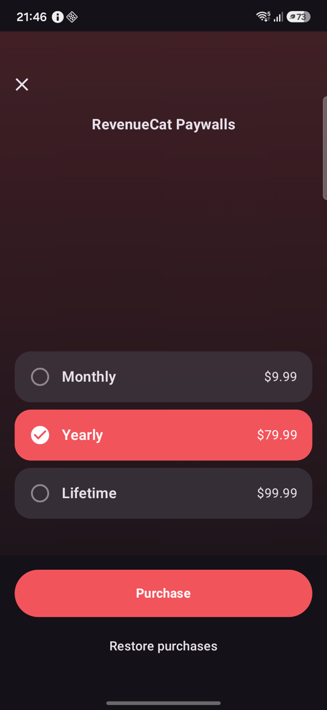<br/><sub><b>Beam Pro</b><br/>RevenueCat paywall</sub></td>
  </tr>
</table>

### iOS (Simulator)

<table>
  <tr>
    <td align="center">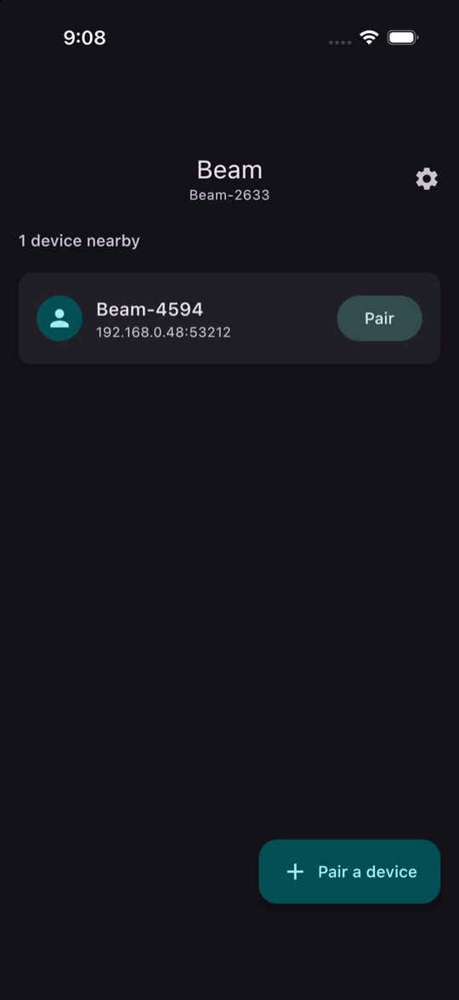<br/><sub><b>Nearby devices</b><br/>iOS discovering the Android phone over Bonjour</sub></td>
    <td align="center">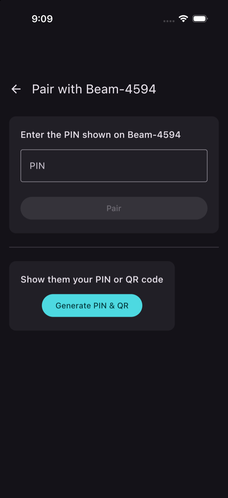<br/><sub><b>Pair with a device</b><br/>Enter their PIN, or show yours</sub></td>
    <td align="center">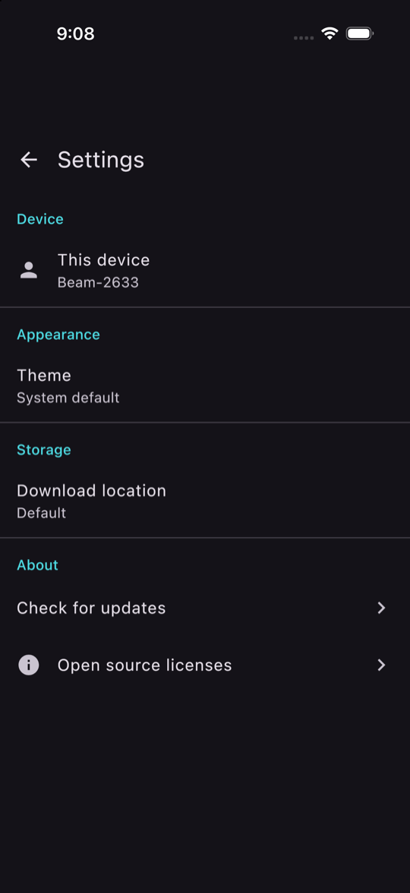<br/><sub><b>Settings</b><br/>Launch on login is desktop-only, so it's hidden</sub></td>
  </tr>
</table>

### Desktop (macOS)

<table>
  <tr>
    <td align="center">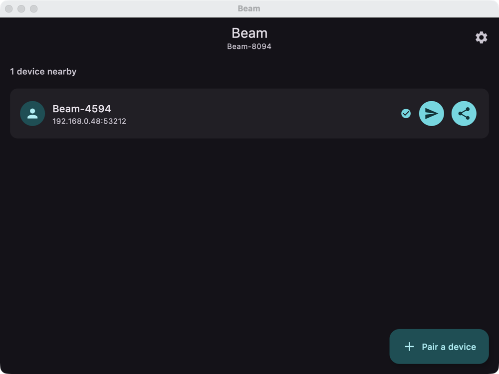<br/><sub><b>Nearby devices</b></sub></td>
    <td align="center">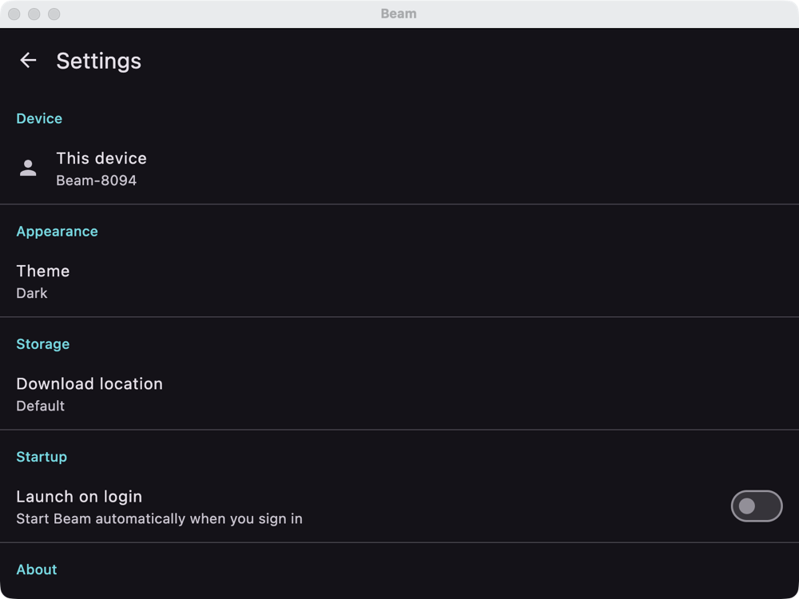<br/><sub><b>Settings</b><br/>Adds launch on login</sub></td>
  </tr>
  <tr>
    <td align="center" colspan="2">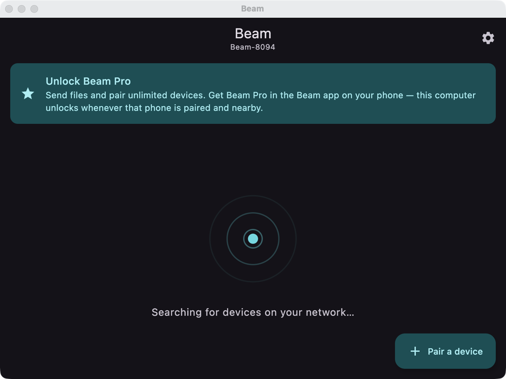<br/><sub><b>Free plan</b><br/>Desktop points to the phone app for Beam Pro</sub></td>
  </tr>
</table>

## Why Beam

Sharing a file or a link between your own phone and laptop usually means emailing it to yourself, messaging yourself on Slack, or fumbling with a cable. Beam skips all of that: devices on the same LAN find each other automatically, and once paired, sharing is a single tap.

The flagship flow: open a link on your phone, hit **Share → Beam**, pick your laptop, and the page opens there **immediately** — no copy-paste, no waiting.

## Features

**Sharing**
- **Automatic discovery** — devices announce themselves over mDNS/Bonjour and appear on every other device on the network within seconds.
- **One-time pairing** — trust is established with a 6-digit PIN or by scanning a QR code (Android), then remembered across launches.
- **Instant sharing** — send text, URLs (which auto-open in the receiving device's browser), or files.
- **Share-sheet integration** — on Android, "Share" from any app straight into Beam.
- **Local-first** — everything runs over your LAN through a small embedded HTTP server; nothing is uploaded anywhere.

**Always available**
- **Android** — a foreground service keeps Beam discoverable when the app is backgrounded.
- **Desktop tray** — closing the window hides it to the menu bar / system tray; click the tray icon or choose *Show Beam* to bring it back. Pairing and receive events also fire native OS notifications (Notification Center / Action Center).

**Beam Pro** — free covers discovery, pairing (up to 2 devices), and text/link sharing; [Beam Pro](#beam-pro) unlocks file transfers and unlimited devices.

**Settings**
- **Theme** — System, Light, or Dark.
- **Download location** — a folder picker on desktop; a subfolder under Downloads on Android/iOS.
- **Launch on login** — desktop only (macOS LaunchAgent, Windows registry Run key, Linux autostart entry).
- **Check for updates** — looks up the latest [GitHub release](https://github.com/samarthsubramanya/Beam/releases) and opens it in your browser if a newer version exists.

## Beam Pro

Beam is free to use for text and links. **Beam Pro** unlocks **file transfers** and **unlimited paired devices** (free pairs up to 2). Purchases run through [RevenueCat](https://www.revenuecat.com/) (`purchases-kmp`), with its Paywall UI on Android and iOS.

| | Free | Pro |
|---|---|---|
| Discovery, PIN/QR pairing | ✓ | ✓ |
| Text and link sharing | ✓ | ✓ |
| Paired devices | up to 2 | unlimited |
| Sending files | — | ✓ |

**Desktop has no store**, and RevenueCat has no desktop SDK, so the desktop app can't sell Pro. Instead it **inherits Pro from a paired phone**: every 30 seconds it asks each paired, reachable phone (`GET /status`, paired devices only) whether it holds Pro, and unlocks while any answers yes. A free desktop shows a promo card pointing to the phone app.

Configure it in [`BillingConfig.kt`](shared/src/commonMain/kotlin/com/beam/app/pro/BillingConfig.kt): the RevenueCat SDK key(s) and the entitlement identifier. The repo currently uses a RevenueCat **Test Store** key (simulated purchases), which is fine for this demo build; swap in the real Google Play / App Store keys before publishing to a store.

## How it works

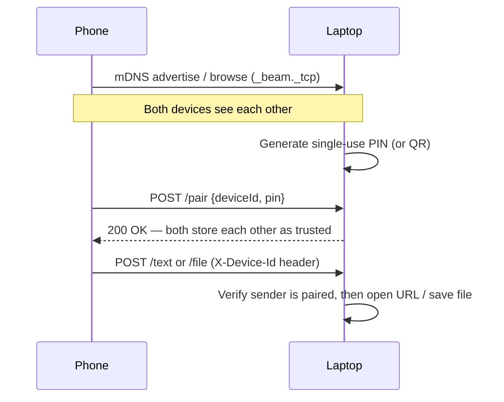

| Concern | Approach |
|---|---|
| Discovery | mDNS/Bonjour — `NsdManager` (Android), `NSNetService`/`NSNetServiceBrowser` (iOS), `jmdns` (Desktop) |
| Transport | An embedded Ktor server (`/pair`, `/text`, `/file`, `/status`) + a multiplatform Ktor HTTP client. It binds port 53212 and falls back to the next free port, so two instances can share one machine; the bound port is what's advertised over mDNS and put in QR codes |
| Trust | A single-use, time-limited PIN (or a QR code encoding the same handshake), verified before any device is marked paired; `/text` and `/file` reject unpaired senders |
| Persistence | SQLDelight for paired devices and transfer history; platform key-value storage (`SharedPreferences` / `NSUserDefaults` / `Preferences`) for the device ID and settings |

Discovery, pairing, and the transport server live in one process-wide `BeamCore` object, deliberately decoupled from any screen's lifecycle — so an Android foreground service or the desktop tray can keep everything running in the background.

## Project structure

```
shared/          Kotlin Multiplatform module — all shared logic and UI (Compose Multiplatform)
  commonMain/    Core app: discovery, pairing, transport, persistence, settings, screens
  androidMain/   Android actuals: NsdManager, foreground service hooks, SharedPreferences
  iosMain/       iOS actuals: NSNetService, NSUserDefaults
  jvmMain/       Desktop actuals: jmdns, java.util.prefs, launch-on-login, folder picker
androidApp/      Android application shell
desktopApp/      Desktop (JVM) shell: window, tray, packaging, app icons
iosApp/          iOS application shell (Xcode project)
images/          README screenshots
```

## Tech stack

- Kotlin Multiplatform & Compose Multiplatform (Android, iOS, Desktop/JVM)
- [Ktor](https://ktor.io/) — embedded server + HTTP client
- [SQLDelight](https://cashapp.github.io/sqldelight/) — typed local persistence
- [qrcode-kotlin](https://github.com/g0dkar/qrcode-kotlin) + [zxing](https://github.com/journeyapps/zxing-android-embedded) — QR generation and scanning
- [RevenueCat](https://www.revenuecat.com/) `purchases-kmp` — subscriptions and paywalls (Android/iOS)
- Koin — dependency injection
- AndroidX Navigation Compose

## Getting started

Requires JDK 17+ and Android Studio (or IntelliJ IDEA with the Kotlin Multiplatform plugin).

**Desktop**
```bash
./gradlew :desktopApp:run
```

**Android**
```bash
./gradlew :androidApp:installDebug
```
Or run the `androidApp` configuration from Android Studio. If Gradle fails at `JdkImageTransform` / `jlink`, point `JAVA_HOME` at Android Studio's bundled JDK rather than a GraalVM one.

**iOS** — open `iosApp/iosApp.xcodeproj` in Xcode and run on a simulator or device. (The simulator shares your Mac's network stack, so it can't run alongside the desktop app: both try to bind port 53212.)

Run any two on the same Wi-Fi network and they'll discover each other automatically.

## Known limitations

- **Pro inheritance is trust-based.** A desktop believes a paired phone's answer to `/status`, so a modified client could claim Pro. That's acceptable for LAN-only sharing between your own devices, but not a security boundary.
- Desktop only unlocks while a Pro phone is paired and reachable on the network.

- iOS QR scanning and showing the device's own LAN IP aren't implemented yet (`getifaddrs` isn't exposed in the current Kotlin/Native platform-libs set) — PIN pairing works everywhere.
- The desktop tray and launch-on-login have been verified on macOS only; the Windows and Linux code paths use the same cross-platform APIs but haven't been run on those systems.
- Launch on login registers the currently running command line, which is correct for a packaged app but captures a throwaway dev classpath when run via `./gradlew :desktopApp:run`.
- Discovery requires all devices to be on the same local network; there's no relay/internet fallback by design.
